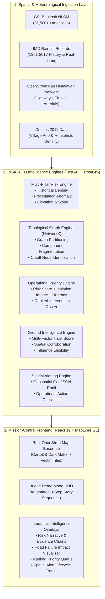

# RISKSETU AI — Geospatial Disaster & Lifeline Network Intelligence Platform

<div align="center">

**Smart India Hackathon (SIH 2026) | Problem Statement ID: 26001 | Team: Beacon Devs**

[](tests/)
[](frontend/)
[](#technology-stack)
[](LICENSE)

*An end-to-end, multi-hazard risk assessment, topological road network isolation simulator, and priority ranking engine for proactive mountain disaster response in Uttarakhand and the Himalayan belt.*

[Live Demo](#sih-judge-demonstration-mode) • [Architecture](#system-architecture) • [Quickstart](#quickstart--installation) • [API Reference](#api-endpoints--contracts) • [Dataset Inventory](#datasets--ingestion-pipeline)

</div>

---

## Executive Overview

Mountain road networks in fragile terrains like the Himalayas are lifeline arteries. Traditional disaster response platforms suffer from a critical flaw: **they equate hazard severity with operational priority**. In mountain logistics, a high-hazard landslide on a redundant highway bypass is far less catastrophic than a moderate landslide on a sole arterial road that completely severs 40+ downstream Himalayan villages from medical triage, food rations, and evacuation routes.

**RISKSETU AI** bridges this critical gap through three core pillars:
1. **Multi-Pillar Hazard Risk Engine**: Computes high-resolution hazard vulnerability using Geological Survey of India (GSI) historical landslides, India Meteorological Department (IMD) precipitation metrics, and digital terrain parameters.
2. **Topological Network Isolation Simulator**: Models road networks as connected spatial graphs. It calculates real-time graph fragmentation ($\Delta$ connected components, severed vertices, and isolated downstream populations) when lifeline corridors are compromised.
3. **Operational Priority Ranking ($\text{Risk} \neq \text{Priority}$)**: A deterministic decision engine synthesizing Hazard Risk, Isolation Severity, and Population Urgency into an actionable, ranked emergency intervention queue.
4. **Verified Ground Intelligence & Spatial Alerts**: Integrates field observer and citizen reports via a multi-factor trust-scoring engine and broadcasts location-bound actionable emergency alerts.

---

## System Architecture



---

## Core Paradigms & Mathematical Foundations

### 1. The Fundamental Principle: $\text{Risk} \neq \text{Priority}$

A fundamental tenet of RISKSETU AI is that hazard severity alone must **never** dictate emergency resource dispatch.

$$\text{Priority Score} = w_1 \cdot \text{HazardRisk} + w_2 \cdot \text{IsolationImpact} + w_3 \cdot \text{UrgencyMetric}$$

| Location | Hazard Risk | Lifeline Redundancy | Isolation Impact | Intervention Priority |
| :--- | :---: | :---: | :---: | :---: |
| **Location A (Valley Bypass)** | **92.0** (Critical) | Dual Arterials (Alternate Route: 15 min) | **LOW** (+0 nodes) | **HIGH** |
| **Location B (Chamoli Gorge)** | **81.0** (High) | Single Bridge / No Bypass Route | **CRITICAL** (+42 nodes cut off) | **CRITICAL (Rank #1)** |

### 2. Topological Graph Partitioning

When a road corridor (e.g., Way `14930128` - Badrinath National Highway NH-58) is compromised:
1. The edge $(u, v)$ is severed in the active road network graph $G = (V, E)$.
2. The graph disconnects into subgraphs $G' = \{C_1, C_2, \dots, C_k\}$.
3. The platform computes:
   - $\Delta \text{Components} = |C_{\text{after}}| - |C_{\text{before}}|$
   - Downstream Isolated Vertices $V_{\text{isolated}}$ (vertices with zero path to regional emergency hubs).
   - Cutoff Population and estimated accessibility delay (e.g., 8.4+ hours foot reconnaissance required).

### 3. Ground Intelligence Trust Metric

Field and citizen observations undergo a rigorous, multi-factor scoring algorithm:
- Observer historical reliability & credential tier.
- Spatial-temporal corroboration with neighboring reports within a 5 km cluster.
- Plausibility verification against physical IMD precipitation thresholds.

> **Important Note:** Trust Score is strictly an **evidence-reliability indicator** and is never presented as an epistemic "probability of truth".

---

## Interactive Frontend & Real-World Map

The RISKSETU frontend is built for high-stakes mission-control operations:
- **100% Real Geographic Basemap**: Powered by **MapLibre GL JS** and OpenStreetMap tiles (CartoDB Dark Matter) centered over Uttarakhand, India (`30.2936° N, 79.5603° E`). Zero fake or generated maps.
- **Dynamic Layer Controls**: Toggle Hazards, Road Networks, Ground Intelligence, and Spatially Bound Alerts independently.
- **Topological Disruption Visualizer**: Watch real road ways flash red upon failure and downstream reaches shift into an isolated amber/hazard topology.
- **Sub-pixel Smooth Animations**: Built with custom `requestAnimationFrame` easing hooks for metric counters and evidence progress bars without layout jank.

---

## SIH Judge Demonstration Mode

The platform features an automated **1-Click Judge Demo Mode** that demonstrates the complete disaster-intelligence story in 9 seamless, narrative steps:

```
[01: Select Chamoli] ──> [02: Risk Computed] ──> [03: Why This Location?] ──> [04: Road Failure Sim]
                                                                                        │
[08: Critical Alert] <── [07: Ground Intel] <── [06: Priority Ranked] <── [05: Network Fragments]
         │
[09: Recommended Action Roster Complete]
```

1. **Select Chamoli Zone**: The map pans and zooms into Chamoli (`30.2936° N, 79.5603° E`).
2. **Compute Risk Score**: Multi-pillar score animates to **98.9 CRITICAL**.
3. **Explain "Why This Location?"**: Deconstructs rainfall anomaly, slope angle, and historical landslide density.
4. **Initiate Road Failure Simulation**: Severing Way `14930128` (Badrinath National Highway NH-58).
5. **Network Fragments**: Baseline graph breaks; +1 isolated subgraph emerges, cutting off 42 downstream nodes.
6. **Intervention Priority Calculation**: Chamoli elevates to **Rank #1 CRITICAL PRIORITY** based on isolation impact.
7. **Ground Intelligence Detected**: Field report corroborates active mudslide with High Confidence and Eligible risk influence.
8. **Spatial Alert Broadcast**: Red perimeter alert deployed with immediate operational checklist.
9. **Action Dispatch**: Evacuation routing and emergency transit stabilization directives generated.

---

## Technology Stack

### Backend
- **Framework**: Python 3.11+, FastAPI (Async, ASGI)
- **Spatial Database**: PostgreSQL 16 + PostGIS extension
- **In-Memory Cache & Rate Limiting**: Redis 7+
- **Graph & Network Modeling**: NetworkX (Spatial edge-contraction, connected components)
- **Validation & Settings**: Pydantic v2 & Pydantic-Settings
- **ORM & Migrations**: SQLAlchemy 2.0 + Alembic

### Frontend
- **UI Framework**: React 19 + TypeScript
- **Build Tool**: Vite 8 (Hot Module Replacement)
- **Mapping Engine**: MapLibre GL JS (with dedicated Web Worker integration)
- **Styling**: Pure Modular Vanilla CSS & CSS Custom Property Design Tokens (Zero bloated utility frameworks)
- **Linting & Code Quality**: Oxlint (0 errors, 0 warnings)

---

## Datasets & Ingestion Pipeline

All raw data sources are audited in [`dataset_inventory.json`](dataset_inventory.json):

| Dataset Name | Source / Provider | Format / Coverage | Records / Details |
| :--- | :--- | :--- | :--- |
| **NLSM Landslide Report** | Geological Survey of India (Bhukosh) | PDF tabular (904 pages) | 31,509 verified landslide coordinates |
| **Sub-Divisional Rainfall** | India Meteorological Department (IMD) | CSV (1901 – 2017) | Monthly & monsoon precipitation norms |
| **Himalayan Road Network** | OpenStreetMap (Geofabrik) | OSM PBF / GeoJSON | Northern Zone arterial & lifeline ways |
| **Population Abstracts** | Office of the Registrar General (Census) | Excel (PCA 2011) | Village-level household counts & demographics |
| **Rajya Sabha Disaster Reports** | Ministry of Home Affairs (MHA) | CSV / XLS | Historic state-wise flood & landslide casualties |

---

## Project Structure

```
risksetu/
├── app/                              # FastAPI Backend Core
│   ├── api/v1/                       # API Endpoints (Health, Risk, Impact, Priority, Alerts)
│   ├── core/                         # Configuration, Logging, Security, Telemetry
│   ├── db/                           # Session Management, PostGIS Engine, Migrations
│   ├── models/                       # SQLAlchemy Spatial Models
│   ├── schemas/                      # Pydantic Schemas & Response Contracts
│   └── services/                     # Domain Intelligence Engines
│       ├── alerts/                   # Spatial Alert Lifecycle & Actions
│       ├── impact/                   # Topological Road Failure & Isolation Graphing
│       ├── ingestion/                # GSI, IMD, OSM, and Census Stream Parsers
│       ├── priority/                 # Operational Priority & Urgency Ranking
│       └── risk/                     # Multi-Pillar Hazard Risk Engine
├── database/                         # Source Datasets & Seed Artifacts
├── dataset_inventory.json            # Complete Audit & Metadata of Ingested Datasets
├── frontend/                         # React 19 + TypeScript + MapLibre GL App
│   ├── public/                       # Static Assets & Icons
│   ├── src/
│   │   ├── components/
│   │   │   ├── alerts/               # Spatial Alert Panels & Checklists
│   │   │   ├── demo/                 # Judge Demo Mode Controller & HUD Ribbon
│   │   │   ├── intelligence/         # Ground Observation & Trust Modals
│   │   │   ├── layout/               # AppShell, Navigation, Telemetry Status
│   │   │   ├── map/                  # Real MapLibre GL Canvas & Location Details
│   │   │   ├── priority/             # Ranked Intervention Prioritization List
│   │   │   ├── simulation/           # Road Severance & Graph Fragmentation Controls
│   │   │   └── workflow/             # Mission Control Workflow Ribbon
│   │   ├── context/                  # Global MapContext State Management
│   │   ├── data/                     # GeoJSON Fixtures & Operational Mock Data
│   │   └── services/                 # Road Simulation & API Client Wrappers
├── tests/                            # Test Suite (255 Unit & Integration Tests)
│   ├── integration/                  # End-to-End API, Security & Flow Tests
│   └── unit/                         # Engine Logic, Topological Graph & Risk Tests
├── docker-compose.yml                # Multi-Container Postgres/PostGIS + Redis
└── pyproject.toml                    # Poetry Python Dependencies
```

---

## Quickstart & Installation

### Prerequisites
- **Node.js**: v18.0.0 or higher (`node -v`)
- **Python**: v3.11 or higher (`python3 -v`)
- **Docker & Docker Compose** (Optional, for running full PostGIS + Redis stack)

---

### 1. Running the Frontend (Real Map Experience)

```bash
cd frontend

# Install dependencies
npm install

# (Optional) Copy and configure environment variables
cp .env.example .env

# Run local development server
npm run dev
```

Open your browser at **`http://localhost:5173/`**.
- Click the **`DEMO`** button in the top left to launch the automated SIH Judge Demonstration.
- Click any location marker on the real map to view the hazard breakdown.
- Click **`SIMULATE ROAD FAILURE`** to watch the real-time graph fragmentation.

To build the frontend for production:
```bash
npm run build
```

---

### 2. Running the Backend API

```bash
# Return to project root
cd ..

# Copy environment variables
cp .env.example .env

# Start PostGIS and Redis services
docker compose up -d db redis

# Install backend dependencies (via Poetry)
poetry install

# Run database migrations
poetry run alembic upgrade head

# Start FastAPI development server
poetry run uvicorn app.main:app --reload --port 8000
```

Interactive API documentation will be available at:
- Swagger UI: **`http://localhost:8000/docs`**
- ReDoc: **`http://localhost:8000/redoc`**
- System Readiness: **`http://localhost:8000/api/v1/readiness`**

---

## Deploying on Render.com

RISKSETU AI is structured as a monorepo containing a **FastAPI backend** (`/app`) and a **React 19 + Vite frontend** (`/frontend`). On Render.com, the recommended architecture deploys the backend as a **Docker Web Service** and the frontend as a **Static Site**.

```
[User Browser] ───> Frontend Static Site (https://<frontend-app>.onrender.com)
                          │
                          ▼ (API calls routed via VITE_API_BASE_URL)
                    Backend Web Service (https://<backend-api>.onrender.com)
                          │
                          ▼
                    PostgreSQL + PostGIS Database
```

### Option A: 1-Click Render Blueprint (Fastest)

This repository includes a [`render.yaml`](render.yaml) specification:
1. In Render Dashboard, click **New +** → **Blueprint**.
2. Connect your GitHub repository (`https://github.com/luckygautam2009-alt/Risksetu.git`).
3. Render automatically provisions the PostgreSQL database, Docker backend Web Service, and React Static Site with all inter-service URLs linked.

---

### Option B: Manual Setup via Render Dashboard

#### 1. Backend Web Service (FastAPI)
- **Service Type**: Web Service
- **Name**: `risksetu-backend` (or `risksetu-api`)
- **Runtime / Environment**: `Docker`
- **Dockerfile Path**: `./Dockerfile`
- **Health Check Path**: `/api/v1/health`
- **Environment Variables**:
  | Variable | Value / Description |
  | :--- | :--- |
  | `APP_ENV` | `production` |
  | `DATABASE_URL` | Render PostgreSQL internal connection string (Render `postgres://` URLs are automatically converted to `postgresql+psycopg2://`) |
  | `JWT_SECRET_KEY` | Cryptographically secure string with 32+ characters |
  | `CORS_ALLOW_ORIGINS` | Comma-separated or JSON list of frontend origins (e.g. `https://risksetu-frontend.onrender.com,http://localhost:5173`) |
  | `OFFLINE_DEMO_MODE` | `true` |
  | `PORT` | Auto-injected by Render (the Dockerfile dynamically starts uvicorn on `${PORT:-8000}`) |

> **Health Verification**: Visiting `https://<your-backend>.onrender.com/` returns:
> ```json
> {"status": "ok", "service": "risksetu-api", "docs": "/api/v1/health"}
> ```

#### 2. Frontend Static Site (React + Vite)
- **Service Type**: Static Site
- **Name**: `risksetu-frontend`
- **Root Directory**: `frontend`
- **Build Command**: `npm install && npm run build`
- **Publish Directory**: `dist`
- **SPA Rewrite Rule**: Under **Redirects/Rewrites**, add `/*` → `/index.html` (Action: `Rewrite`)
- **Environment Variables**:
  | Variable | Value / Description |
  | :--- | :--- |
  | `VITE_API_BASE_URL` | Your deployed backend URL (e.g., `https://risksetu-backend.onrender.com`). **Must not be left empty in production**, otherwise requests default to relative paths. |

---

## API Endpoints & Contracts

All endpoints adhere to a standardized `{ data, meta }` response envelope:

| Method | Endpoint | Description |
| :--- | :--- | :--- |
| `GET` | `/api/v1/health` | Service liveness probe |
| `GET` | `/api/v1/readiness` | Database, Redis, and engine readiness checks |
| `POST` | `/api/v1/risk/evaluate` | Computes multi-factor landslide hazard risk for a coordinate |
| `POST` | `/api/v1/impact/simulate-failure` | Simulates road way severance & calculates network isolation |
| `GET` | `/api/v1/priority/interventions` | Returns ranked intervention roster ($\text{Risk} \neq \text{Priority}$) |
| `POST` | `/api/v1/ground-reports` | Submits field observation with real-time trust scoring |
| `GET` | `/api/v1/alerts/spatial` | Retrieves active spatial alerts within a geographic bounding box |
| `POST` | `/api/v1/alerts/{id}/acknowledge` | Acknowledges alert dispatch with audit logging |

---

## Testing & Quality Assurance

The codebase undergoes rigorous automated verification across both backend and frontend:

```bash
# Run all backend unit & integration tests
poetry run pytest tests/ -v

# Run frontend linting (Oxlint)
cd frontend && npx oxlint

# Run frontend TypeScript type checking
cd frontend && npx tsc --noEmit
```

- **Backend Tests**: 255/255 passed across risk calculation, graph isolation, alert lifecycle, and security authorization.
- **Frontend Code Quality**: 0 errors, 0 warnings across all 37 components and hooks.

---

## Contributors & Acknowledgements

Developed with pride for the **Smart India Hackathon 2026** by **Team Beacon Devs**:
- Dedicated to the first responders, district disaster management authorities (DDMAs), and communities across Uttarakhand and the Himalayan region.

---

<div align="center">
<b>RISKSETU AI — Bridging Hazard Assessment and Tactical Lifeline Operations</b>
</div>
