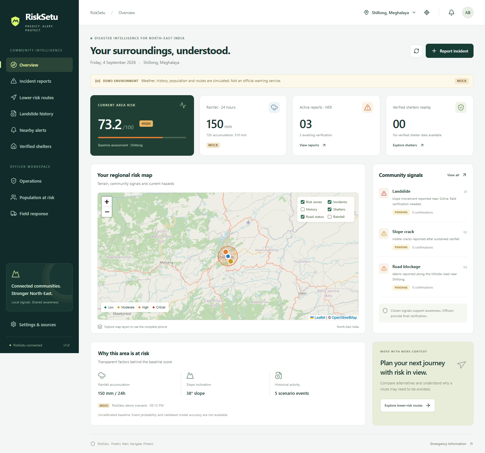

# RiskSetu

**Predict. Alert. Navigate. Protect.**

RiskSetu expands this starter into a working disaster-intelligence prototype for North-East India. It includes a map-first citizen dashboard, approved officer/admin workspaces, incident reporting with private evidence, community confirmations, conservative route comparisons, verified shelters, population exposure and persistent in-app alerts.

**Start here: [Runbook and demo accounts](docs/RUNBOOK.md).**

- [Implementation status and limitations](docs/DELIVERY.md)
- [Provider contracts and live configuration](docs/INTEGRATIONS.md)
- [Security and deployment boundaries](docs/SECURITY.md)
- [Initial audit and implementation plan](docs/IMPLEMENTATION_PLAN.md)

Default mode is clearly labelled **MOCK** and works without paid API keys. Backend data persists in SQLite; live mode uses Supabase. No real government shelters, API access, model accuracy or calibrated probabilities are invented. Keep demo mode local.

## Dashboard



## Features

- **Citizen workspace:** regional risk map, rainfall context, historical inventory, incident reporting, private photos/videos, nearby alerts and community confirmations.
- **Officer workspace:** approved access, report verification, incident briefings, dispatch tracking, road status and verified shelter management.
- **Risk-aware navigation:** compare route alternatives, exclude blocked/critical corridors and disclose missing assessment coverage.
- **Decision support:** transparent risk factors and estimated population exposure; community reports never become scientifically verified through votes alone.
- **Offline support:** queued reports/media, cached risk metadata and alerts, installable PWA shell and offline emergency information.
- **Provider boundaries:** Supabase Auth/Storage/Realtime, optional historical inventory importer, IndianAPI weather adapter, terrain feature interface, OSRM routing and Gemini adapters.

## Stack

React 19 · TypeScript · Vite · Tailwind CSS · Leaflet/OpenStreetMap · FastAPI · Python 3.12 · SQLite demo persistence · Supabase live persistence · scikit-learn training pipeline

## Quick start — Windows PowerShell

Run from the repository root (the folder containing `backend` and `frontend`):

```powershell
Copy-Item .env.example .env
py -3.12 -m venv backend/.venv-risksetu
backend/.venv-risksetu/Scripts/python.exe -m pip install -r backend/requirements.txt
cd frontend
npm ci
```

Backend terminal:

```powershell
cd backend
.venv-risksetu/Scripts/python.exe -m uvicorn app.main:app --host 127.0.0.1 --port 8000 --reload
```

Frontend terminal:

```powershell
cd frontend
npm run dev
```

Open [http://127.0.0.1:5173](http://127.0.0.1:5173). Backend documentation is at [http://127.0.0.1:8000/api/docs](http://127.0.0.1:8000/api/docs).

For macOS/Linux, create the environment with `python3.12 -m venv backend/.venv-risksetu` and use `backend/.venv-risksetu/bin/python` instead of the Windows executable path.

### Demo accounts

The login screen has Citizen, Officer and Admin demo buttons. Accounts are `citizen@risksetu.demo`, `officer@risksetu.demo` and `admin@risksetu.demo`; the default local demo password is `RiskSetuDemo!2026`. These are synthetic accounts, not operational credentials. Never publish a running demo-mode server to the public internet.

## Validation

```powershell
cd backend
.venv-risksetu/Scripts/python.exe -m pytest -q
cd ../frontend
npm run build
```

The initial implementation passed 14 backend tests, TypeScript/production build, browser workflow checks and a first-visit offline/PWA reload check. Tests use isolated temporary data. These checks do not establish prediction accuracy or operational readiness.

## Live integration status

The default weather, terrain, historical events, population and route geometry are synthetic and labelled **MOCK**. No government shelters are fabricated. The baseline score is uncalibrated; event probability remains unavailable until supported by validated modelling.

Live operation requires your Supabase project, approved data sources, measured risk cells, Google/Gemini credentials and independent integration/security validation. Apply the supplied migration only after reviewing it in your own Supabase project. Browser-push delivery, an approved SMS gateway, continuously scheduled ingestion and operational model validation remain follow-up work.

See the [runbook](docs/RUNBOOK.md) for configuration, inventory import, model training and the citizen-to-officer demo flow. Secrets, uploaded evidence, local databases and installed dependencies are excluded from this repository.
